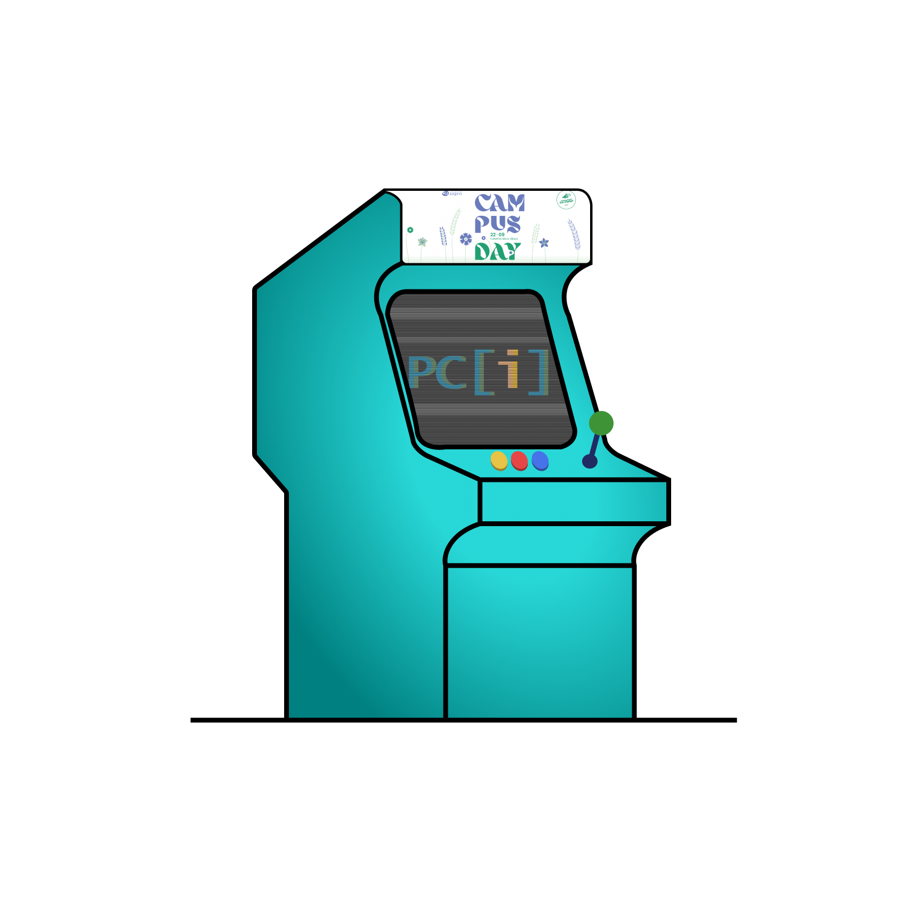

# Arcad'UA

Application mobile réalisée dans le cadre du CampusDay 2022 de l'Université d'Angers.

    

## Setup :

Après l'installation du projet, un fix temporaire à cause d'une librairie est requise :

Dans le fichier :
`node_modules/react-native-camera/src/RNCamera.js`

Retiré `ViewPropTypes` de la liste d'import provenant de `react-native` et le placer dans un import de source `deprecated-react-native-prop-types`
Une PR et une Issue on déjà été fait et sont en attente de traitement
